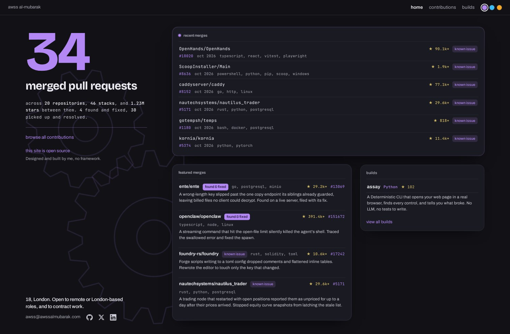
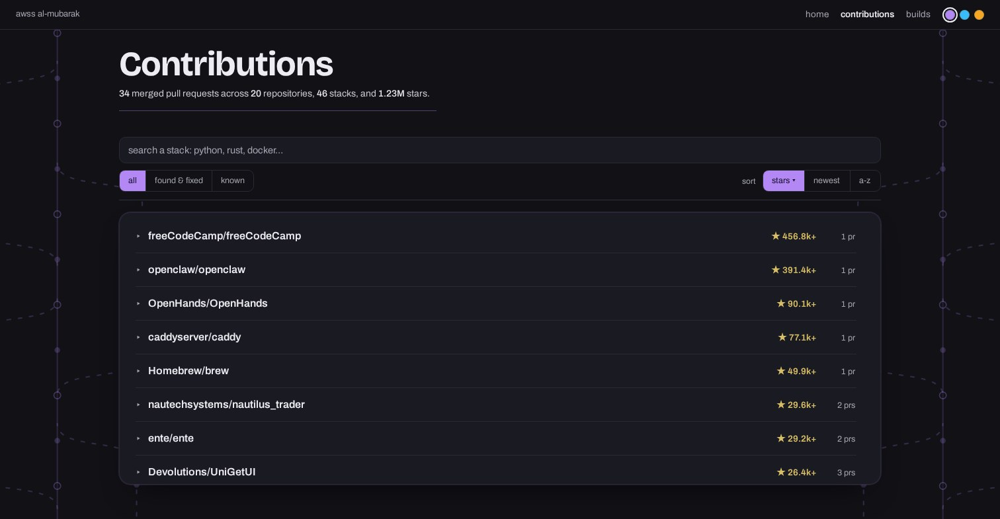
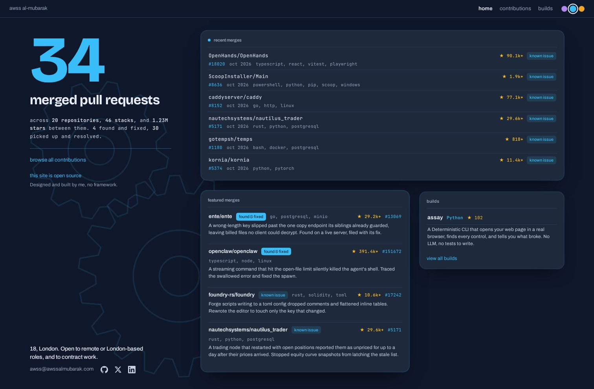
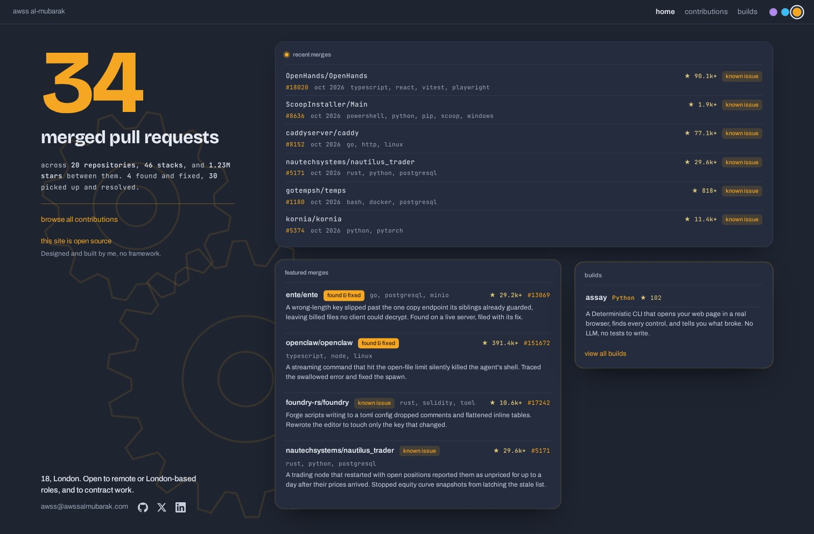

<p align="center">
  
</p>

<h1 align="center">awssalmubarak.com</h1>

<p align="center">
  <a href="LICENSE"></a>
  <a href="https://awssalmubarak.com"></a>
</p>

<p align="center">
  <a href="#the-virtualized-ledger">The ledger</a> · <a href="#how-it-works">How it works</a> · <a href="#run-it">Run it</a> · <a href="#tests">Tests</a> · <a href="#layout">Layout</a> · <a href="#license">License</a>
</p>

---

<p align="center">
  
</p>

---

The source of my personal site. It's a static site with no runtime dependencies and no framework,
generated by a small Python standard-library pipeline, and its contributions page stays smooth
whether it lists twenty merged pull requests or twenty thousand.

Live at [awssalmubarak.com](https://awssalmubarak.com).

---

## The virtualized ledger

The contributions page is a record of every merged pull request I've made. At the scale I'm heading
toward that's tens of thousands of rows, so the list is virtualized by hand in plain JavaScript.
Only the rows near the viewport are in the DOM, a repository's pull requests are built only when you
expand it, and search is debounced and filters the data instead of rebuilding the page on every
keystroke.

Here's what that's worth, measured against a version that renders every row at once, with 2,500
repositories and 13,724 merged pull requests:

| | Naive (render everything) | Virtualized (this site) |
|---|---|---|
| DOM nodes | 127,306 | 281 |
| Re-render one sort | 279 ms | 3 ms |
| Time to interactive | 534 ms | 312 ms |

You don't have to take the numbers on trust. `bench/` regenerates them on your own machine, see
[the benchmark](bench/README.md).



---

## How it works

The site is generated, not maintained by hand. Each merged pull request is one small markdown file
in `data/entries/`. `bin/site_data.py` reads them and writes `data/contributions.json`, and
`bin/build_pages.py` inlines that data into three pages, so each one loads with no requests beyond a
stylesheet and a font. `bin/deploy.py` publishes the built pages to GitHub Pages. Each repository's
star count lives once in `data/stars.json` and `bin/refresh_stars.py` pulls every count from GitHub,
so no count is copied into an entry or left to drift.

- No framework and no build tooling. All you need is Python and a browser.
- Three themes, switched from the swatches in the top right, built on CSS custom properties.
- Generative SVG backdrops drawn in the browser: meshing gears on the home page, a git merge-graph
  behind the ledger, a drafting blueprint behind the builds.
- A Content-Security-Policy on every page, and every URL that comes from data is validated before it
  reaches an `href`.

### The three themes

| violet | slate | nordic |
|---|---|---|
|  |  |  |

---

## Run it

```
python3 bin/site_data.py        # entries to data/contributions.json
python3 bin/build_pages.py      # data to the three pages in site/
python3 -m http.server --directory site
```

Then open http://localhost:8000.

---

## Tests

```
python3 -m unittest discover -s tests
```

They cover the pipeline: a rebuild is reproducible, the stats have the right shape, a new entry
increments the sequence and lands in the output, and the built pages carry the security hardening
and the virtualized list.

---

## Layout

```
bin/     the pipeline, reads entries, builds pages, deploys
data/    one markdown file per merged PR, plus the per-repo star counts, the builds and the featured picks
site/    the three page templates, the shared stylesheet and script, the built output
bench/   the reproducible performance benchmark
tests/   the pipeline tests
```

---

## License

MIT, see [LICENSE](LICENSE).
